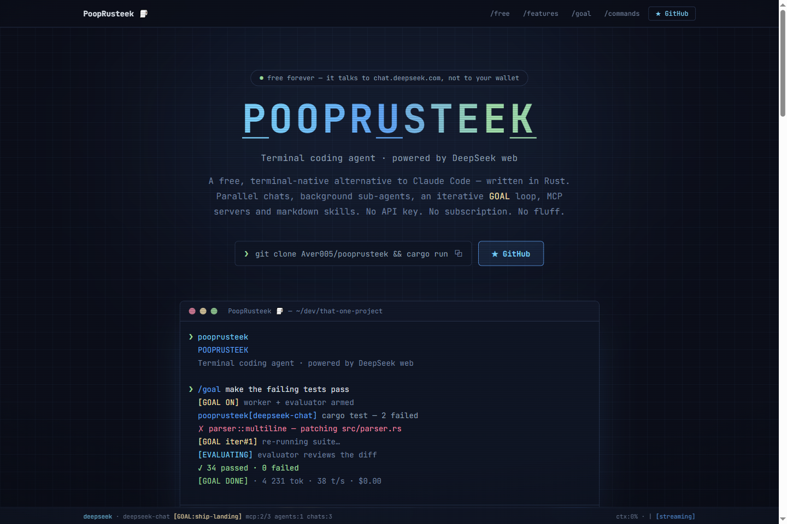

<div align="center">

# 🧻 pooprusteek-landing

**The landing page for [PoopRusteek](https://github.com/Aver005/pooprusteek) —
a free, terminal-native Rust coding agent with an unapologetic name.**

*Terminal coding agent · powered by DeepSeek web · $0.00/month forever*

[](https://bun.sh)
[](https://vite.dev)
[](https://react.dev)
[](https://www.typescriptlang.org)
[](https://tailwindcss.com)
[](https://motion.dev)



*Yes, the terminal actually types that, in a loop, forever. It's very committed.*

</div>

---

## What is this

A single-page, fully animated landing that sells PoopRusteek the way it deserves:
**as a TUI**. The palette is lifted *verbatim* from the agent's
`src/tui/theme.rs`, the hero logo replays the TUI's staggered letter-pulse
animation, the whole page sits under a CRT scanline overlay, and the bottom of
the screen is a working replica of the real status bar — scroll progress is
reported as `ctx:N%` next to a spinning `| / - \`.

| Section | What it does |
|---|---|
| **Hero** | Letter-pulse logo, typewriter terminal running a real `/goal` session that ends in `[GOAL DONE] · $0.00` |
| **`/free`** | `$0.00` in 9xl, a ledger of *why* it's free (cookie auth, local SHA-3 PoW), and a live nonce ticker |
| **`/features`** | 8 capability cards with ratatui-style `┌ ┐ └ ┘` corners that light up on hover |
| **`/goal`** | Auto-cycling replica of the real GOAL-mode status badges: `[GOAL ON] → [GOAL iter#1] → [EVALUATING] → [GOAL DONE]` |
| **`/commands`** | Two counter-scrolling marquees of 28 real slash commands |
| **Tech strip** | `1` binary · `~15k` lines of Rust · `0` GC pauses · `3` platforms |
| **Status bar** | Fixed bottom bar: `deepseek · deepseek-chat [GOAL:ship-landing] mcp:2/3 …` |

## Quick start

Bun only — no npm, no pnpm, no lockfile archaeology.

```sh
bun install
bun dev        # http://localhost:5173/pooprusteek/
```

| Script | What |
|---|---|
| `bun dev` | Vite dev server with HMR |
| `bun run build` | `tsc -b && vite build` → `dist/` |
| `bun run preview` | Serve `dist/` at `http://localhost:4173/pooprusteek/` |
| `bun run lint` | oxlint |

## Deploy

The site is hosted by **aaaver-app** (`E:\Projects\Me\aaaver-app`), a Bun
server that maps `sites/<slug>/` → `https://aaaver.ru/<slug>/`.

```
bun run build                 dist/ with base=/pooprusteek/
      │
      ▼
deploy-site.bat pooprusteek E:\Projects\Me\pooprusteek-landing\dist
      │                       scp → temp dir → atomic rename
      ▼
https://aaaver.ru/pooprusteek/        live, zero downtime, no restart
```

The one rule that everything hangs on: **`base: '/pooprusteek/'` in
`vite.config.ts` must equal the slug**. Change one, change both.

## Design system

Colors are not designed here — they are **imported truth** from
`pooprusteek/src/tui/theme.rs` and declared as Tailwind tokens in
`src/index.css` (`@theme`):

| Token | Hex | TUI origin |
|---|---|---|
| `ink` | `#0B0E19` | `THEME.bg` |
| `panel` / `panel-deep` | `#111727` / `#0F1524` | `THEME.panel` / `THEME.input_bg` |
| `fg` | `#E2E8F0` | `THEME.fg` |
| `accent` / `accent-dim` / `accent-soft` | `#60A5FA` / `#3B82F6` / `#7DD3FC` | the blues |
| `ok` / `warn` / `err` | `#A6E3A1` / `#F9E2AF` / `#F38BA8` | Catppuccin-ish status trio |
| `line` / `dim` / `soft` / `sel` | `#2A3854` / `#7888A4` / `#94A3B8` / `#222D48` | chrome |

Typography: **JetBrains Mono Variable** for everything — headings, body,
buttons. It's a terminal. There is no second font.

Motion: [Motion](https://motion.dev) for reveals, `AnimatePresence` badge
swaps and scroll-linked progress; pure CSS keyframes for marquees, cursor
blink and spinners. `MotionConfig reducedMotion="user"` + manual
`useReducedMotion` guards on every JS-timer animation — the page is fully
usable with animations off.

## Repo map

```
src/
├── App.tsx                  section order lives here
├── index.css                @theme tokens, CRT overlay (.crt), grid bg, keyframes
├── lib/anim.ts              shared variants (rise/stagger), GITHUB_URL
└── components/
    ├── Nav.tsx              fixed top bar
    ├── Hero.tsx             logo + copy + install command + terminal
    ├── Logo.tsx             the letter-pulse POOPRUSTEEK wordmark
    ├── TerminalDemo.tsx     scripted typewriter session (edit SCRIPT to change it)
    ├── ZeroDollars.tsx      $0.00 + ledger + PoW nonce ticker
    ├── Features.tsx         8 cards + SectionTitle (exported, reused)
    ├── GoalLoop.tsx         auto-cycling GOAL status badges
    ├── Commands.tsx         double marquee
    ├── TechStrip.tsx        stat counters
    ├── Footer.tsx           CTA + credits
    └── StatusBar.tsx        fixed bottom TUI status bar
```

---

<div align="center">

Built with ratatui-flavored CSS, tokio-free JavaScript,
and the same questionable naming decisions as the original.

`/quit` ▊

</div>
